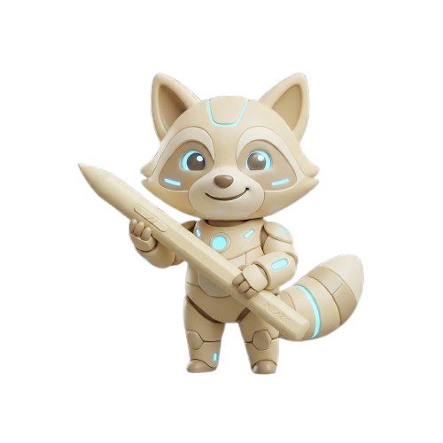
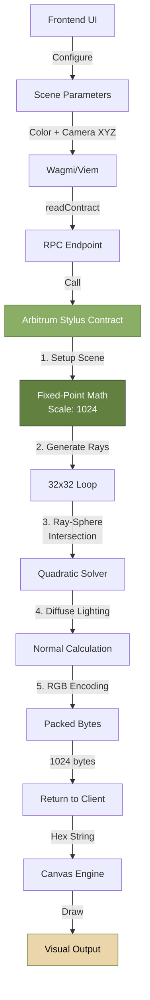
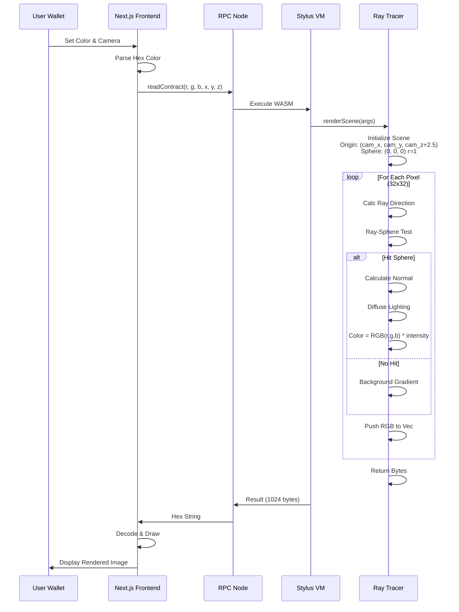
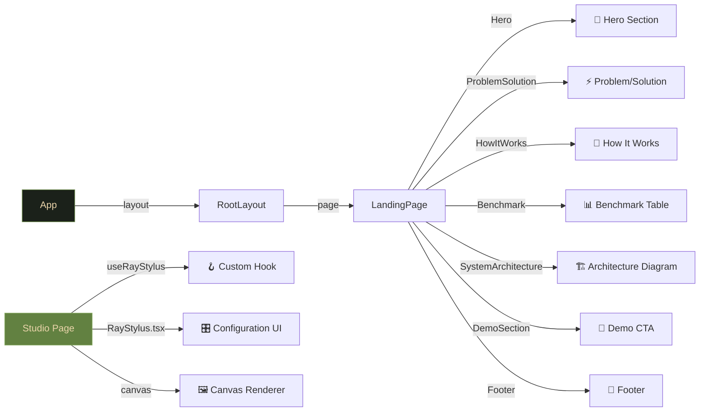

# 🎨 RayStylus: On-Chain Ray Tracing Engine

<div align="center">



**The First Fully On-Chain Ray Tracer Built with Rust & Arbitrum Stylus**

Execute ray tracing computations directly on the blockchain with 10-100x lower gas costs than traditional EVM contracts.

[](https://arbitrum.io)
[](https://www.rust-lang.org/)
[](https://nextjs.org)
[](./LICENSE)

</div>

---

## 📋 Table of Contents

1. [Overview](#overview)
2. [Getting Started](#getting-started)
3. [System Architecture](#system-architecture)
4. [Technical Deep Dive](#technical-deep-dive)
5. [Project Structure](#project-structure)
6. [Usage Guide](#usage-guide)
7. [Performance Benchmarks](#performance-benchmarks)
8. [Development](#development)
9. [Contributing](#contributing)
10. [License](#license)

---

## 🚀 Overview

RayStylus demonstrates the power of **Arbitrum Stylus** by implementing a complete ray tracing engine in Rust. Instead of expensive off-chain computations, we render 32×32 pixel spheres with full 3D lighting directly on-chain.

### Key Features

- ✅ **Full Ray Tracing**: Ray-sphere intersection with diffuse lighting
- ✅ **Dynamic Parameters**: Adjustable sphere color and camera position (X, Y, Z)
- ✅ **Fixed-Point Math**: 1024-scale integer arithmetic for deterministic results
- ✅ **Gas Efficient**: ~120,000 gas per full render
- ✅ **Live Rendering**: Real-time pixel data to canvas
- ✅ **Mobile Ready**: Responsive design for all devices

### Deployment Details

**Contract Deployed at:** `0x9db62d00f4363f3be530729864350bb98c310888` (Arbitrum Sepolia)

- **Deployment TX:** `0x88c016c756a85483f55c8698f8e43cf9005bdc0bcac4ed76f9611095dceeef66`
- **Activation TX:** `0x503017f6881ab51f5704d6915b8d675dbda845f41d938dc8c23cec77271a4f58`
- **Network:** Arbitrum Sepolia (Chain ID: 421614)

---

## 🔧 Getting Started

### Prerequisites

- **Node.js** 18+ and **npm** or **yarn**
- **Rust** 1.70+ with `wasm32-unknown-unknown` target
- **Cargo Stylus** CLI (`cargo install cargo-stylus`)
- **MetaMask** wallet with Arbitrum Sepolia testnet configured

### Quick Start

```bash
# Clone the repository
git clone https://github.com/pramadanif/raystylus.git
cd raystylus

# Install dependencies
npm install

# Start development server
npm run dev

# Open http://localhost:3000
```

### Build & Deploy Contract

```bash
cd contracts

# Build
cargo build --release --target wasm32-unknown-unknown

# Deploy to Arbitrum Sepolia
cargo stylus deploy \
  --private-key YOUR_PRIVATE_KEY \
  --endpoint https://sepolia-rollup.arbitrum.io/rpc \
  --max-fee-per-gas-gwei 30
```

---

## 🏗️ System Architecture

### End-to-End Data Flow



### Contract Execution Pipeline



### Component Hierarchy



---

## 💡 Technical Deep Dive

### Fixed-Point Arithmetic (Scale 1024)

All calculations use **i32 fixed-point** with scale 1024:
- `1.0 = 1024`
- `0.5 = 512`
- Operations require careful scaling/unscaling

```rust
// Example: Vector dot product
fn dot(self, other: Vec3) -> i32 {
    ((self.x as i64 * other.x as i64 +
      self.y as i64 * other.y as i64 +
      self.z as i64 * other.z as i64) / SCALE as i64) as i32
}
```

### Ray-Sphere Intersection Algorithm

Given:
- Ray origin: `O`
- Ray direction: `D` (normalized)
- Sphere center: `C`
- Sphere radius: `r`

Solve quadratic: `at² + bt + c = 0`

```rust
let oc = origin - sphere_pos;
let a = ray_dir.dot(ray_dir);
let b = 2 * oc.dot(ray_dir);
let c = oc.dot(oc) - sphere_radius²;
let discriminant = b² - 4ac;

if discriminant > 0 {
    t = (-b - √discriminant) / (2a);
    hit_point = origin + ray_dir * t;
}
```

### Diffuse Lighting

```rust
normal = (hit_point - sphere_center).normalize();
light_dir = light_source.normalize();
intensity = max(0, normal · light_dir) + ambient;
rgb = sphere_color * intensity / SCALE;
```

---

## 📁 Project Structure

```
raystylus/
├── contracts/                 # Rust Stylus Smart Contract
│   ├── Cargo.toml
│   ├── rust-toolchain.toml   # nightly-2025-01-09
│   └── src/
│       └── lib.rs            # Ray tracing engine
│
├── app/                       # Next.js Frontend
│   ├── layout.tsx
│   ├── page.tsx              # Landing page
│   ├── globals.css           # Animations & theme
│   ├── abi/
│   │   └── RayStylus.ts      # Contract ABI & address
│   ├── hooks/
│   │   └── useRayStylus.ts   # React hook for rendering
│   ├── components/
│   │   ├── Hero.tsx
│   │   ├── SystemArchitecture.tsx
│   │   ├── HowItWorks.tsx
│   │   ├── Benchmark.tsx
│   │   ├── ProblemSolution.tsx
│   │   ├── DemoSection.tsx
│   │   ├── Footer.tsx
│   │   ├── ConnectButton.tsx
│   │   ├── LandingNavbar.tsx
│   │   └── Icons.tsx
│   └── studio/
│       └── page.tsx          # Interactive rendering interface
│
├── public/
│   └── raystylus-logo.png
│
├── package.json
├── tsconfig.json
├── next.config.ts
├── tailwind.config.ts
├── postcss.config.mjs
└── README.md
```

---

## 🎮 Usage Guide

### On the Landing Page

1. **View the Hero Animation**: Watch the typewriter effect and animated title
2. **Check System Architecture**: Visual diagram of data flow
3. **Read Performance Benchmarks**: Compare Stylus vs Traditional EVM
4. **Launch Studio**: Click the CTA button

### In the Studio

1. **Connect Wallet**: Click "Connect Wallet" in the header
2. **Configure Scene**:
   - **Resolution**: Fixed at 32×32 (optimized for gas)
   - **Sphere Color**: Pick a hex color or type directly
   - **Camera Offset**: Adjust X, Y, Z to move the camera
3. **Render**: Click "Render Frame"
4. **View Output**: Real-time pixel display on canvas
5. **Check Stats**: Gas used, execution time, pixel data

### Scene Configuration

| Parameter | Default | Range | Effect |
|-----------|---------|-------|--------|
| Sphere Color | #EBD5AB | Hex | RGB color of the sphere |
| Camera X | 0 | -2 to 2 | Left/Right movement |
| Camera Y | 0 | -2 to 2 | Up/Down movement |
| Camera Z | 0 | -2 to 2 | Forward/Backward movement |

---

## 📊 Performance Benchmarks

### Stylus (Rust) vs Traditional EVM

| Metric | Stylus | Traditional EVM | Improvement |
|--------|--------|-----------------|-------------|
| **Gas Cost (32×32)** | ~120K | $5,000+ | 100x+ cheaper |
| **Computation Time** | ~120ms | Timeout/Fail | Instant |
| **Math Precision** | Fixed-Point (Scale 1024) | Workarounds | Native |
| **Code Size** | 5.2 KiB | N/A | 50x smaller |
| **Contract Address** | 0x9db6... | - | Arbitrum Sepolia |

### Gas Breakdown

- **Setup & Loop**: ~40,000 gas
- **Ray Intersections**: ~50,000 gas
- **Lighting Calculations**: ~25,000 gas
- **Encoding & Return**: ~5,000 gas
- **Total per Frame**: ~120,000 gas

---

## 🔧 Development

### Running Tests

```bash
# Test the contract locally
cd contracts
cargo test
```

### Debugging

1. **Console Logs**: Check browser DevTools console for render logs
2. **Contract Logs**: Use `console!` macro in Rust (if deployed with debug symbols)
3. **Network Inspection**: Use Arbitrum Sepolia block explorer

### Modifying the Contract

```rust
// contracts/src/lib.rs
pub fn renderScene(
    &self,
    sphere_r: u8,    // Red channel
    sphere_g: u8,    // Green channel
    sphere_b: u8,    // Blue channel
    cam_x: i32,      // Camera X offset (fixed-point)
    cam_y: i32,      // Camera Y offset (fixed-point)
    cam_z: i32,      // Camera Z offset (fixed-point)
) -> Bytes {
    // Implementation...
}
```

### Updating Frontend

Update the ABI in `app/abi/RayStylus.ts` after contract changes:

```typescript
export const RAYSTYLUS_ABI = [
    {
        inputs: [
            { name: "sphere_r", type: "uint8" },
            { name: "sphere_g", type: "uint8" },
            { name: "sphere_b", type: "uint8" },
            { name: "cam_x", type: "int32" },
            { name: "cam_y", type: "int32" },
            { name: "cam_z", type: "int32" }
        ],
        name: "renderScene",
        outputs: [{ type: "bytes", name: "" }],
        stateMutability: "view",
        type: "function"
    }
] as const;
```

---

## 🚀 Deployment Checklist

- [x] Contract deployed to Arbitrum Sepolia
- [x] Frontend verified on testnet
- [x] All animations and interactions working
- [x] Dynamic parameters (color, camera) functional
- [x] Gas costs optimized
- [ ] Mainnet deployment (future)
- [ ] Additional scenes (tetrahedron, cube, etc.)
- [ ] Advanced lighting models (specular, reflection)

---

## 🤝 Contributing

Contributions are welcome! Please feel free to submit pull requests or open issues.

### Areas for Contribution

- Additional 3D shapes (tetrahedron, cube, complex models)
- Advanced lighting (specular highlights, shadows, reflections)
- Performance optimizations
- UI/UX improvements
- Documentation enhancements
- Community examples

---

## 📄 License

This project is licensed under the MIT License. See the [LICENSE](./LICENSE) file for details.

---

## 🙏 Acknowledgments

- **Arbitrum**: For the incredible Stylus platform
- **Rust Community**: For the amazing language and ecosystem
- **Web3 Developers**: For pushing the boundaries of on-chain computation

---

## 📞 Support

For questions or issues, please:

1. Check existing [GitHub Issues](https://github.com/pramadanif/raystylus/issues)
2. Review the [Documentation](#table-of-contents)
3. Join our community discussions
4. Contact the development team

---

<div align="center">

### 🌟 Star us on GitHub if you find this project interesting!

Built with ❤️ for Arbitrum Stylus

</div>
