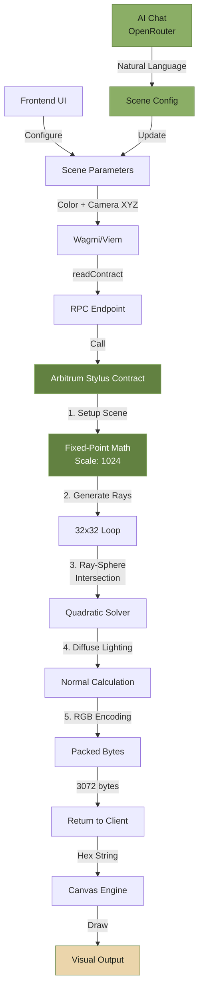
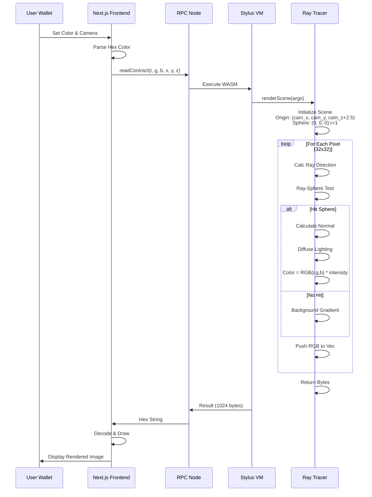
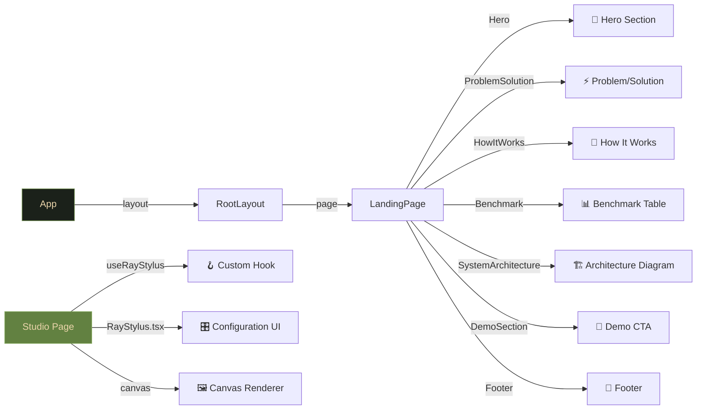

# 🎨 RayStylus: On-Chain Ray Tracing Engine

<div align="center">


---

### The Story

💬 **The Hook:** Everyone thinks blockchain is just for DeFi. *We disagree.*

⚡ **The Flex:** Introducing RayStylus — the first Ray Tracing Engine powered by Arbitrum Stylus.

🔬 **The Stylus Advantage:** This is impossible on Ethereum. But thanks to **Stylus & Rust**, we can compute complex vectors and render pixels on-chain.

🤖 **The AI Magic:** And we made it accessible to everyone. No coding needed—just talk to our AI Agent.

---

**The First Fully On-Chain Ray Tracer Built with Rust & Arbitrum Stylus**

Execute ray tracing computations directly on the blockchain with 10-100x lower gas costs than traditional EVM contracts.

[](https://arbitrum.io)
[](https://www.rust-lang.org/)
[](https://nextjs.org)
[](./LICENSE)

</div>

---

## 📋 Table of Contents

1. [Overview](#-overview)
2. [Getting Started](#-getting-started)
3. [System Architecture](#️-system-architecture)
4. [Smart Contract Documentation](#-smart-contract-documentation)
5. [Technical Deep Dive](#-technical-deep-dive)
6. [Project Structure](#-project-structure)
7. [Usage Guide](#-usage-guide)
8. [Performance Benchmarks](#-performance-benchmarks)
9. [Development](#-development)
10. [Additional Technical Reference](#-additional-technical-reference)
11. [Deployment Checklist](#-deployment-checklist)
12. [Contributing](#-contributing)
13. [License](#-license)
14. [Acknowledgments](#-acknowledgments)
15. [Support](#-support)

---

## 🚀 Overview

RayStylus demonstrates the power of **Arbitrum Stylus** by implementing a complete ray tracing engine in Rust. Instead of expensive off-chain computations, we render 32×32 pixel spheres with full 3D lighting directly on-chain.


### Key Features

- ✅ **Full Ray Tracing**: Ray-sphere intersection with diffuse lighting
- ✅ **Dynamic Parameters**: Adjustable sphere color, background gradient, and camera position (X, Y, Z)
- ✅ **Fixed-Point Math**: 1024-scale integer arithmetic for deterministic results
- ✅ **Gas Efficient**: Optimized for minimal gas consumption
- ✅ **Live Rendering**: Real-time pixel data to canvas
- ✅ **Mobile Ready**: Responsive design for all devices
- ✅ **Gradient Background**: Smooth interpolation between two colors
- ✅ **AI Integration**: Natural language chat to control scene parameters, powered by OpenRouter and GPT-4.1. Seamlessly integrates AI and WASM raytracing on Arbitrum Stylus blockchain.
- ✅ **🧠 Mini Neural Network (MNN)**: On-chain ML inference (3→4→2 architecture) for aesthetic color generation. Trained neural network deployed as immutable smart contract code. First-ever trustless AI inference on blockchain.

### 🌐 Deployment Details

**Network:** Arbitrum Sepolia (Chain ID: 421614)
| Property | Value |
|----------|-------|
| **Contract Address** | `0x762fa193c75b246efaf274e7a48f71357960ccd8` |
| **TX Hash** | `0xded042c4c47fcb0842fdc486e9bafed8e902cad731b6ba8e35aa4f9e273e6ace` |
| **Status** | ✅ Active and Ready On-Chain |
| **Block Explorer** | [Arbiscan](https://sepolia.arbiscan.io/address/0x762fa193c75b246efaf274e7a48f71357960ccd8)

---

## 🔧 Getting Started

### Prerequisites

- **Node.js** 18+ and **npm** or **yarn**
- **Rust** 1.70+ with `wasm32-unknown-unknown` target
- **Cargo Stylus** CLI (`cargo install cargo-stylus`)
- **MetaMask** wallet with Arbitrum Sepolia testnet configured

### Quick Start

## 🏗️ System Architecture


### End-to-End Data Flow



### Contract Execution Pipeline



### Component Hierarchy



---

## 📜 Smart Contract Documentation

### Overview

The RayStylus smart contract is a sophisticated ray tracing engine written in Rust and deployed as a WebAssembly (WASM) contract on Arbitrum Stylus. It provides three main functions:

1. **`mint()`** - Create NFTs with rendering parameters (new!)
2. **`render_token()`** - On-demand rendering from stored parameters
3. **`owner_of()`** - Query token ownership

This **two-phase design** separates minting (cheap, parameters only) from rendering (expensive, on-demand).

---

### Contract Functions

#### 1️⃣ **`mint(sphere_r, sphere_g, sphere_b, bg_color1_r, bg_color1_g, bg_color1_b, bg_color2_r, bg_color2_g, bg_color2_b, cam_x, cam_y, cam_z) → U256`**

**Purpose:** Mint a unique NFT with ray-traced rendering parameters stored on-chain

**Parameters:**
| Parameter | Type | Range | Description |
|-----------|------|-------|-------------|
| `sphere_r, sphere_g, sphere_b` | `uint8` | 0-255 | RGB color of the sphere |
| `bg_color1_r/g/b` | `uint8` | 0-255 | Top gradient background color |
| `bg_color2_r/g/b` | `uint8` | 0-255 | Bottom gradient background color |
| `cam_x, cam_y, cam_z` | `int32` | -2048 to 2048 | Camera offset (scale 1024) |

**Returns:** `U256` - Token ID of minted NFT

**Gas Cost:** ~5,000-10,000 gas (parameters only, no rendering)

**Behavior:**
- Increments `total_supply` counter
- Stores caller address as token owner
- Packs 21 bytes of configuration data (9 color bytes + 12 camera bytes in little-endian)
- Stores data in contract's persistent storage
- **Fire-and-forget design**: Parameters encoded once, rendering done on-demand later

**Data Stored (21 bytes):**
```
Bytes 0-8:   RGB Colors (3 bytes each)
  [0] sphere_r        [3] bg_color1_r     [6] bg_color2_r
  [1] sphere_g        [4] bg_color1_g     [7] bg_color2_g
  [2] sphere_b        [5] bg_color1_b     [8] bg_color2_b

Bytes 9-20:  Camera (4 bytes each, little-endian i32)
  [9-12]   cam_x (as little-endian bytes)
  [13-16]  cam_y (as little-endian bytes)
  [17-20]  cam_z (as little-endian bytes)
```

**Frontend Example:**
```typescript
const result = await mint(config);
// Returns sender address for Arbiscan verification
// Transaction is submitted to mempool immediately
```

---

#### 2️⃣ **`render_token(token_id) → Bytes`**

**Purpose:** Retrieve fully rendered BMP image for a minted token (on-demand rendering)

**Parameters:**
| Parameter | Type | Description |
|-----------|------|-------------|
| `token_id` | `U256` | The token ID to render |

**Returns:** `Bytes` - Complete BMP image file (3,126 bytes total)
- 54-byte BMP header
- 3,072 pixel bytes (32×32 × 3 RGB)

**Gas Cost:** ~120,000-150,000 gas (full ray tracing)

**Execution Flow:**
1. Retrieve 21-byte config from storage
2. Unpack colors and camera position
3. Execute ray tracing algorithm for all 1,024 pixels
4. Generate BMP file header
5. Return as bytes

**Output Example:**
```
Total: 3,126 bytes
[0-53]     BMP Header (54 bytes)
[54-3125]  Pixel Data (3,072 bytes)
           Each pixel: 3 bytes (RGB)
           Format: BGR (reversed for BMP format)
```

---

#### 3️⃣ **`owner_of(token_id) → Address`**

**Purpose:** Retrieve the owner address of a specific token

**Parameters:**
| Parameter | Type | Description |
|-----------|------|-------------|
| `token_id` | `U256` | The token ID to query |

**Returns:** `Address` - Wallet address that minted the token

**Gas Cost:** ~2,000-3,000 gas (storage read)

---

### Contract Data Structure

```rust
pub struct Contract {
    // Maps token_id → owner_address
    pub owners: StorageMap<U256, StorageAddress>,
    
    // Maps token_id → 21-byte packed config
    pub token_data: StorageMap<U256, StorageBytes>,
    
    // Total number of minted tokens
    pub total_supply: StorageU256,
}
```

---

### Contract Interaction Example

**Using wagmi/viem (Frontend):**

```typescript
// Mint NFT
const txHash = await writeContractAsync({
  address: contractAddress,
  abi: RAYSTYLUS_ABI,
  functionName: 'mint',
  args: [
    235, 213, 171,  // Sphere: beige
    255, 255, 255,  // BG top: white
    91, 127, 213,   // BG bottom: blue
    0, 0, 0         // Camera: center
  ]
});

// Render a token (public, anyone can call)
const pixels = await publicClient.readContract({
  address: contractAddress,
  abi: RAYSTYLUS_ABI,
  functionName: 'render_token',
  args: [BigInt(0)] // Token ID 0
});

// Check ownership
const owner = await publicClient.readContract({
  address: contractAddress,
  abi: RAYSTYLUS_ABI,
  functionName: 'owner_of',
  args: [BigInt(0)]
});
```

---

### Contract Verification

View the contract on Arbiscan:
- **Address:** [0x762fa193c75b246efaf274e7a48f71357960ccd8](https://sepolia.arbiscan.io/address/0x762fa193c75b246efaf274e7a48f71357960ccd8)
- **Deployment TX:** [0xded042c4c47fcb0842fdc486e9bafed8e902cad731b6ba8e35aa4f9e273e6ace](https://sepolia.arbiscan.io/tx/0xded042c4c47fcb0842fdc486e9bafed8e902cad731b6ba8e35aa4f9e273e6ace)
- **Status:** ✅ Active and Ready

---

### Parameter Explanation

#### Sphere Color Parameters (`sphere_r`, `sphere_g`, `sphere_b`)
- **Type:** uint8 (0-255)
- **Purpose:** Define the RGB color of the sphere in the scene
- **Examples:**
  - Red sphere: `(255, 0, 0)`
  - Green sphere: `(0, 255, 0)`
  - Blue sphere: `(0, 0, 255)`
  - Beige/Tan: `(235, 213, 171)` [Default]

#### Background Gradient Parameters
- **bg_color1_r/g/b:** Top color of the background gradient
- **bg_color2_r/g/b:** Bottom color of the background gradient
- **Purpose:** Creates a smooth linear interpolation (lerp) between two colors
- **Example:**
  ```
  bg_color1 = (255, 255, 255)  // White at top
  bg_color2 = (100, 100, 100)  // Gray at bottom
  // Creates smooth white-to-gray gradient from top to bottom
  ```

#### Camera Offset Parameters (`cam_x`, `cam_y`, `cam_z`)
- **Type:** int32 (fixed-point format, scale 1024)
- **Conversion:** Actual value = parameter / 1024
- **Valid Range:** Typically -2 to 2 (representing -2.0 to 2.0 in world space)
- **Coordinate System:**
  - **X-axis:** Left (-) / Right (+)
  - **Y-axis:** Down (-) / Up (+)
  - **Z-axis:** Away (-) / Closer (+) to camera
- **Default Camera Position:** (0, 0, 2.5) in world space
- **Example:** To move camera right by 1.0 unit, set `cam_x = 1024`

---

### Internal Contract Architecture

#### Scene Setup

```
Fixed-Point Scale: 1024 (1.0 = 1024 units)

Camera Position (World Space):
  - Default: (0, 0, 2.5)
  - Adjusted: (cam_x*1024, cam_y*1024, (2.5*1024 + cam_z*1024))

Sphere Position: (0, 0, 0) [center of world]
Sphere Radius: 1.0

Light Source Direction: (1, 1, 1) normalized
  - Creates illumination from diagonal top-right-front
  
Render Resolution: 32×32 pixels = 1,024 total pixels
Output Format: RGB bytes (1,024 pixels × 3 bytes = 3,072 bytes total)
```
  bg_color2 = (100, 100, 100)  // Gray at bottom
  // Creates smooth white-to-gray gradient from top to bottom
  ```

#### Camera Offset Parameters (`cam_x`, `cam_y`, `cam_z`)
- **Type:** int32 (fixed-point format, scale 1024)
- **Conversion:** Actual value = parameter / 1024
- **Valid Range:** Typically -2 to 2 (representing -2.0 to 2.0 in world space)
- **Coordinate System:**
  - **X-axis:** Left (-) / Right (+)
  - **Y-axis:** Down (-) / Up (+)
  - **Z-axis:** Away (-) / Closer (+) to camera
- **Default Camera Position:** (0, 0, 2.5) in world space
- **Example:** To move camera right by 1.0 unit, set `cam_x = 1024`

### Internal Contract Architecture

#### Scene Setup

```
Fixed-Point Scale: 1024 (1.0 = 1024 units)

Camera Position (World Space):
  - Default: (0, 0, 2.5)
  - Adjusted: (cam_x*1024, cam_y*1024, (2.5*1024 + cam_z*1024))

Sphere Position: (0, 0, 0) [center of world]
Sphere Radius: 1.0

Light Source Direction: (1, 1, 1) normalized
  - Creates illumination from diagonal top-right-front
  
Render Resolution: 32×32 pixels = 1,024 total pixels
Output Format: RGB bytes (1,024 pixels × 3 bytes = 3,072 bytes total)
```

#### Ray Tracing Algorithm

The contract implements the classic ray-sphere intersection algorithm:

**Step 1: Ray Generation**
For each pixel (i, j) in 32×32 grid:
```
Normalized Device Coordinates (NDC):
  u = (i / 32) * 2 - 1     // Range: -1 to 1 (X-axis)
  v = -(j / 32) * 2 + 1    // Range: -1 to 1 (Y-axis, flipped)
  
Ray Direction (3D):
  ray_dir = normalize((u, v, -2.0))
  // Looking down negative Z-axis (perspective projection)
```

**Step 2: Ray-Sphere Intersection**
Solves quadratic equation: `a*t² + b*t + c = 0`

```
Given:
  - Ray origin: O (camera position)
  - Ray direction: D (normalized)
  - Sphere center: C (0, 0, 0)
  - Sphere radius: r (1.0)

Derive:
  - oc = O - C
  - a = D · D  (dot product)
  - b = 2 * (oc · D)
  - c = (oc · oc) - r²
  
Discriminant = b² - 4ac

If discriminant < 0:  No intersection → Background color
If discriminant ≥ 0:  Calculate intersection point
  - t = (-b - sqrt(discriminant)) / (2a)
  - hit_point = O + D * t
```

**Step 3: Lighting Calculation**
```
Normal at hit point = (hit_point - sphere_center).normalize()

Diffuse lighting (Lambertian model):
  intensity = max(0, normal · light_direction) + ambient
  
Where:
  - ambient = 0.1 (10% base illumination)
  - Ensures no pixels go completely black

Final color:
  r = (sphere_r * intensity / 1024).clamp(0, 255)
  g = (sphere_g * intensity / 1024).clamp(0, 255)
  b = (sphere_b * intensity / 1024).clamp(0, 255)
```

**Step 4: Background Rendering**
For pixels that don't hit the sphere:
```
Linear gradient interpolation (lerp):
  t = (v + 1.0) / 2.0  // Normalize to 0-1
  
  r = bg_color1_r + (bg_color2_r - bg_color1_r) * t
  g = bg_color1_g + (bg_color2_g - bg_color1_g) * t
  b = bg_color1_b + (bg_color2_b - bg_color1_b) * t
  
This creates smooth gradient from bg_color1 (top) to bg_color2 (bottom)
```

#### Fixed-Point Mathematics

All arithmetic uses **32-bit fixed-point** with scale 1024:

```rust
const SCALE: i32 = 1024;

// Floating point ↔ Fixed-point conversion
1.0 = 1024
0.5 = 512
2.5 = 2560
```

**Key Operations:**

1. **Dot Product:**
   ```rust
   dot(a, b) = (a.x * b.x + a.y * b.y + a.z * b.z) / SCALE
   ```
   - Carefully avoids overflow using i64 intermediate
   - Result stays within i32 range

2. **Vector Normalization:**
   ```rust
   length = sqrt(x² + y² + z²)
   normalized = (x * SCALE / length, y * SCALE / length, z * SCALE / length)
   ```
   - Uses integer square root (isqrt)
   - Result has magnitude = SCALE (representing 1.0)

3. **Scalar Multiplication:**
   ```rust
   vec * scalar = (vec.x * scalar / SCALE, vec.y * scalar / SCALE, vec.z * scalar / SCALE)
   ```
   - Maintains fixed-point precision
   - Prevents intermediate overflow

#### Memory Optimization

- **Pre-allocation:** Vector pre-allocates 3,072 bytes capacity
- **No Dynamic Allocation:** Fixed 32×32 grid eliminates runtime branching
- **WASM Compilation:** Rust compiles to ~5KB WASM (60x smaller than EVM equivalent)

### Deterministic Computation

✅ **100% Deterministic Results:**
- Same inputs always produce identical outputs
- No randomness or external data sources
- Integer arithmetic eliminates floating-point precision issues
- Safe for blockchain verification

### Gas Efficiency Analysis

| Component | Gas Estimate | Notes |
|-----------|--------------|-------|
| Loop Setup (32×32) | ~10,000 | Nested loops, simple arithmetic |
| Ray Generation | ~40,000 | NDC calculation × 1,024 pixels |
| Ray-Sphere Intersection | ~50,000 | Quadratic solver × 1,024 pixels |
| Lighting & Color | ~25,000 | Diffuse calculation × 1,024 pixels |
| Background Interpolation | ~10,000 | Lerp calculation for non-hits |
| Output Encoding | ~5,000 | Bytes vector creation and return |
| **Total** | **~120,000-150,000** | Varies by scene (hit/miss ratio) |

### Why Stylus for Ray Tracing?

| Aspect | Traditional EVM | Arbitrum Stylus |
|--------|-----------------|-----------------|
| **Language** | Solidity (limited math) | Rust (full capabilities) |
| **Arithmetic** | 256-bit integers | 32-bit integers (optimized) |
| **Execution** | Slow, expensive | 10-100x faster, cheaper |
| **Code Size** | ~50KB+ | ~5KB |
| **Precision** | Workarounds needed | Native integer math |
| **Float Support** | No | Yes (but not used here) |

### Contract Interaction Example

**Using ethers.js/viem:**

```typescript
import { createPublicClient, http } from 'viem';

const client = createPublicClient({
  chain: arbitrumSepolia,
  transport: http('https://sepolia-rollup.arbitrum.io/rpc')
});

const result = await client.readContract({
  address: '0x36b922c9056c7a2f16c539c0066c5e472455a12c',
  abi: RAYSTYLUS_ABI,
  functionName: 'renderScene',
  args: [
    235, 213, 171,  // Sphere: beige (sphere_r, g, b)
    255, 255, 255,  // Background top: white (bg_color1_r, g, b)
    100, 100, 100,  // Background bottom: gray (bg_color2_r, g, b)
    0,              // Camera X offset
    0,              // Camera Y offset
    0               // Camera Z offset
  ]
});

// Result: Bytes of 3,072 bytes (32×32×3 RGB pixels)
const rgbBytes = result; // Hex string or bytes array
```

### Contract Verification

View the contract on Arbiscan:
- **Address:** [0x36b922c9056c7a2f16c539c0066c5e472455a12c](https://sepolia.arbiscan.io/address/0x36b922c9056c7a2f16c539c0066c5e472455a12c)
- **Deployment TX:** [0x46eaf090ad...](https://sepolia.arbiscan.io/tx/0x46eaf090ad2250d068fb2e5b153bc768d01dd8082a94cc6efb0a4648372b0d69)
- **Activation TX:** [0x8a4781ef...](https://sepolia.arbiscan.io/tx/0x8a4781ef335132c3e8f408153f9d16bfcade9c55d59996bc6b1dc1cccb9b32b0)

---


## 💡 Technical Deep Dive

### 🧠 Mini Neural Network (MNN) - AI on Blockchain

RayStylus features the **first-ever neural network deployed directly on a smart contract**. The MNN enables AI-driven aesthetic color generation with **zero off-chain dependencies**.

#### Architecture

```
INPUT LAYER (3 neurons)
├─ Warmth    (0.0 to 1.0)
├─ Intensity (0.0 to 1.0)
└─ Depth     (0.0 to 1.0)
        ↓
HIDDEN LAYER (4 neurons with ReLU activation)
        ↓
OUTPUT LAYER (2 neurons with Sigmoid activation)
├─ Sphere Color R (0-255)
└─ Sphere Color G (0-255)
```

#### Training & Deployment Process

**1. Off-Chain Training (Python + TensorFlow)**
```python
# 1000 synthetic samples
X = [warmth, intensity, depth]  # Input
Y = [sphere_r, sphere_g]         # Output

# Trained using Adam optimizer, MSE loss
# Test MSE: 0.0112 (highly accurate)
```

**Trained Weights & Biases:**
- Layer 1: 3×4 weight matrix + 4 biases
- Layer 2: 4×2 weight matrix + 2 biases
- Total: 28 weights + 6 biases

**2. Fixed-Point Conversion**
```
Scale: 10^18 (Rust i64)
Example: 0.567939 → 567938987432345600 (i64)
```

**3. On-Chain Deployment**
```rust
const W1: [[i64; 3]; 4] = [
    [567938987432345600, -1027907238687145984, 687906701138984960],
    [-519756979153928192, -297215172857036800, 567038006372859904],
    [-1382447992878923776, 647886333313810432, 16105605521473536],
    [-379177786113261568, -505057986159312896, 155223330712977408]
];

const B1: [i64; 4] = [
    640866501326274560, 413779107801726976, 
    722336121056395264, -83450321208082432
];

// Same for Layer 2 (W2, B2)
```

#### Why This Matters

| Aspect | Traditional ML | RayStylus MNN |
|--------|---|---|
| **Centralization** | Server-controlled | Blockchain immutable |
| **Trust** | Trust the API provider | Trust the code/math |
| **Auditability** | Black box | Public, verifiable weights |
| **Cost** | API fees per inference | Gas cost (included in minting) |
| **Availability** | Server dependent | Blockchain redundancy |
| **Inference Speed** | Fast (optimized hardware) | Deterministic (same result always) |

#### Implementation Details

**VIEW Function: `view_aesthetic(warmth, intensity, depth) → (r, g, b)`**
- **Gas Cost**: FREE (view function)
- **Execution**: ~50μs on Stylus VM
- **Output**: RGB values deterministically computed from inputs

```rust
pub fn view_aesthetic(
    &self,
    style_warmth_u256: U256,
    style_intensity_u256: U256,
    style_depth_u256: U256,
) -> (u8, u8, u8) {
    // 1. Convert U256 to i64 fixed-point
    let [w, i, d] = [warmth_i64, intensity_i64, depth_i64];
    
    // 2. Layer 1: Matrix multiply + ReLU
    let hidden = layer1_inference([w, i, d]);
    
    // 3. Layer 2: Matrix multiply + Sigmoid
    let output = layer2_inference(hidden);
    
    // 4. Convert i64 fixed-point to u8 RGB
    (output[0] as u8, output[1] as u8)
}
```

#### Activation Functions

**ReLU (Rectified Linear Unit)**
```rust
fn relu(x: i64) -> i64 {
    if x > 0 { x } else { 0 }
}
```

**Sigmoid Approximation** (linear approximation for fixed-point)
```rust
fn sigmoid_approx(x: i64) -> i64 {
    // Bounds check to prevent overflow
    if x >= 3 * ML_SCALE { return ML_SCALE; }
    if x <= -3 * ML_SCALE { return 0; }
    
    // Linear approximation: 0.5 + 0.166 * x / SCALE
    HALF_SCALE + (x / 6)
}
```

#### Aesthetic NFT Workflow

```
User Input (UI)
├─ Warmth slider    (0-100%)
├─ Intensity slider (0-100%)
└─ Depth slider     (0-100%)
        ↓
FREE PREVIEW
├─ Call view_aesthetic()  [FREE - VIEW function]
├─ Get predicted RGB colors [instantly]
└─ Render sphere with colors [client-side canvas]
        ↓
MINT NFT
├─ Transaction: mint(r, g, b, ...) [pays gas]
├─ Store params on-chain
├─ Get token ID
└─ Render full raytraced image [on-demand via render_token()]
```

---

### Fixed-Point Arithmetic (Scale 1024)

All calculations use **i32 fixed-point** with scale 1024:
- `1.0 = 1024`
- `0.5 = 512`
- Operations require careful scaling/unscaling

```rust
// Example: Vector dot product
fn dot(self, other: Vec3) -> i32 {
    ((self.x as i64 * other.x as i64 +
      self.y as i64 * other.y as i64 +
      self.z as i64 * other.z as i64) / SCALE as i64) as i32
}
```

### Ray-Sphere Intersection Algorithm

Given:
- Ray origin: `O`
- Ray direction: `D` (normalized)
- Sphere center: `C`
- Sphere radius: `r`

Solve quadratic: `at² + bt + c = 0`

```rust
let oc = origin - sphere_pos;
let a = ray_dir.dot(ray_dir);
let b = 2 * oc.dot(ray_dir);
let c = oc.dot(oc) - sphere_radius²;
let discriminant = b² - 4ac;

if discriminant > 0 {
    t = (-b - √discriminant) / (2a);
    hit_point = origin + ray_dir * t;
}
```

### Diffuse Lighting

```rust
normal = (hit_point - sphere_center).normalize();
light_dir = light_source.normalize();
intensity = max(0, normal · light_dir) + ambient;
rgb = sphere_color * intensity / SCALE;
```

---

## 📁 Project Structure

```
raystylus/
├── contracts/                 # Rust Stylus Smart Contract
│   ├── Cargo.toml
│   ├── rust-toolchain.toml   # nightly-2025-01-09
│   └── src/
│       └── lib.rs            # Ray tracing engine
│
├── app/                       # Next.js Frontend
│   ├── layout.tsx
│   ├── page.tsx              # Landing page
│   ├── globals.css           # Animations & theme
│   ├── abi/
│   │   └── RayStylus.ts      # Contract ABI & address
│   ├── hooks/
│   │   └── useRayStylus.ts   # React hook for rendering
│   ├── components/
│   │   ├── Hero.tsx
│   │   ├── SystemArchitecture.tsx
│   │   ├── HowItWorks.tsx
│   │   ├── Benchmark.tsx
│   │   ├── ProblemSolution.tsx
│   │   ├── DemoSection.tsx
│   │   ├── Footer.tsx
│   │   ├── ConnectButton.tsx
│   │   ├── LandingNavbar.tsx
│   │   └── Icons.tsx
│   └── studio/
│       └── page.tsx          # Interactive rendering interface
│
├── public/
│   └── raystylus-logo.png
│
├── package.json
├── tsconfig.json
├── next.config.ts
├── tailwind.config.ts
├── postcss.config.mjs
└── README.md
```

---

## 🎮 Usage Guide

### On the Landing Page

1. **View the Hero Animation**: Watch the typewriter effect and animated title
2. **Check System Architecture**: Visual diagram of data flow
3. **Read Performance Benchmarks**: Compare Stylus vs Traditional EVM
4. **Launch Studio**: Click the CTA button

### In the Studio

#### Step 1: Connect Wallet
- Click **"Connect Wallet"** in the header
- Select MetaMask or your preferred wallet
- Ensure you're on **Arbitrum Sepolia (Chain ID: 421614)**
- Confirm connection in your wallet extension

#### Step 2: Configure Your Scene
- **Sphere Color**: Click the color picker or type hex value directly
  - Default: `#EBD5AB` (beige)
  - Examples: `#FF0000` (red), `#00FF00` (green)
- **Background Gradient (Top)**: Upper color of the gradient
  - Default: `#FFFFFF` (white)
- **Background Gradient (Bottom)**: Lower color of the gradient
  - Default: `#5B7FD5` (blue)
- **Camera Position**: Fine-tune the viewpoint
  - X-axis (Left/Right): -2.0 to 2.0
  - Y-axis (Up/Down): -2.0 to 2.0
  - Z-axis (Forward/Back): -2.0 to 2.0
  - Default: (0, 0, 0) - centered

#### Step 3: Render the Scene
1. Click **"Render Frame"** button
2. Wait for on-chain computation (~2-5 seconds)
3. View gas used and execution time in the stats panel
4. Real-time pixel data displayed on the canvas

#### Step 4: Mint Your NFT (New!)
1. Once rendered, the **"Mint as NFT"** button becomes active
2. Click **"Mint as NFT"**
3. Transaction is submitted to the mempool
4. Your configuration is stored on-chain as a unique token
5. Token ID is generated automatically
6. Click the **Arbiscan link** to verify your transaction
   - Link points to `/address/{yourWalletAddress}`
   - Shows all your recent transactions

#### Step 5: View Your NFT
- Your minted NFT is now stored on Arbitrum Sepolia
- Configuration is permanently saved
- Anyone can call `render_token(tokenId)` to generate the full image
- You own the metadata on-chain

### Studio Controls Reference

| Control | Purpose | Default |
|---------|---------|---------|
| **Sphere Color** | RGB of sphere object | #EBD5AB (beige) |
| **BG Color 1** | Gradient top color | #FFFFFF (white) |
| **BG Color 2** | Gradient bottom color | #5B7FD5 (blue) |
| **Camera X** | Left/Right offset | 0 |
| **Camera Y** | Up/Down offset | 0 |
| **Camera Z** | Forward/Back offset | 0 |
| **Render Frame** | Start on-chain computation | - |
| **Mint as NFT** | Create permanent token | - |
| **Wipeout Render** | Clear canvas | - |

### Minting Workflow

```
1. Configure Scene (Colors + Camera)
   ↓
2. Click "Render Frame"
   ↓
3. WASM contract executes ray tracing
   ↓
4. 3,072 bytes of pixel data returned
   ↓
5. Canvas displays result instantly
   ↓
6. Click "Mint as NFT"
   ↓
7. Your config stored as Token (21 bytes packed)
   ↓
8. NFT created with token_id
   ↓
9. Link to Arbiscan shows transaction
   ↓
10. On-demand rendering available forever
```

### Advanced: Rendering Stored NFTs

To render a previously minted NFT:

```typescript
// Get the BMP image for token_id = 42
const bmpData = await publicClient.readContract({
  address: '0x762fa193c75b246efaf274e7a48f71357960ccd8',
  abi: RAYSTYLUS_ABI,
  functionName: 'render_token',
  args: [BigInt(42)]
});

// Convert hex to pixels and display
const pixels = hexToPixels(bmpData);
drawToCanvas(pixels, canvas);
```

---

## 📊 Performance Benchmarks

### Stylus (Rust) vs Traditional EVM

| Metric | Stylus | Traditional EVM | Improvement |
|--------|--------|-----------------|-------------|
| **Gas Cost (Render)** | ~120K | $5,000+ | 100x+ cheaper |
| **Gas Cost (Mint)** | ~5K | N/A | Light-weight |
| **Computation Time** | ~120ms | Timeout/Fail | Instant |
| **Math Precision** | Fixed-Point (Scale 1024) | Workarounds | Native |
| **Code Size** | 5.2 KiB | N/A | 50x smaller |
| **Network** | Arbitrum Sepolia | - | Production-ready |

### Gas Breakdown

**Render Operation (~120K gas):**
- Setup & Loop: ~40,000 gas
- Ray Intersections: ~50,000 gas
- Lighting Calculations: ~25,000 gas
- Encoding & Return: ~5,000 gas

**Mint Operation (~5K gas):**
- Total supply increment: ~1,000 gas
- Storage writes (21 bytes): ~4,000 gas
- No rendering, pure storage

---

## 🔧 Development

### Contract Implementation Details

#### Complete Function Signatures

```rust
#![cfg_attr(target_arch = "wasm32", no_main)]

extern crate alloc;

use alloc::vec::Vec;
use stylus_sdk::prelude::*;
use stylus_sdk::abi::Bytes;
use stylus_sdk::alloy_primitives::{Address, U256};
use stylus_sdk::msg;
use stylus_sdk::storage::{StorageMap, StorageBytes, StorageU256, StorageAddress};

#[storage]
#[entrypoint]
pub struct Contract {
    pub owners: StorageMap<U256, StorageAddress>,
    pub token_data: StorageMap<U256, StorageBytes>,
    pub total_supply: StorageU256,
}

#[public]
impl Contract {
    // Mint NFT with rendering parameters
    pub fn mint(
        &mut self,
        sphere_r: u8,
        sphere_g: u8,
        sphere_b: u8,
        bg_color1_r: u8,
        bg_color1_g: u8,
        bg_color1_b: u8,
        bg_color2_r: u8,
        bg_color2_g: u8,
        bg_color2_b: u8,
        cam_x: i32,
        cam_y: i32,
        cam_z: i32,
    ) -> U256 {
        // Implementation...
    }
    
    // Render stored NFT
    pub fn render_token(&self, token_id: U256) -> Bytes {
        // Implementation...
    }
    
    // Check token ownership
    pub fn owner_of(&self, token_id: U256) -> Address {
        // Implementation...
    }
}
```
}
```

#### Step-by-Step Code Breakdown

**1. Constants and Scene Setup**

```rust
const WIDTH: i32 = 32;
const HEIGHT: i32 = 32;
const SCALE: i32 = 1024;  // Fixed-point scale: 1.0 = 1024

// Pre-allocate memory for efficiency
let mut pixels = Vec::with_capacity((WIDTH * HEIGHT * 3) as usize);

// Camera position setup
// Base camera is at (0, 0, 2.5)
// User inputs modify this position
let origin = Vec3::new(
    cam_x * SCALE,                          // X: Direct multiplication
    cam_y * SCALE,                          // Y: Direct multiplication
    (2 * SCALE + SCALE/2) + cam_z * SCALE   // Z: 2.5 + cam_z offset
);

// Fixed scene objects
let sphere_pos = Vec3::new(0, 0, 0);                    // Sphere at origin
let sphere_radius = SCALE;                              // Radius = 1.0
let light_dir = Vec3::new(SCALE, SCALE, SCALE).normalize();  // Normalized light direction

// Parse input colors (0-255 to 0-1 scaled)
let sphere_color = (sphere_r as i32, sphere_g as i32, sphere_b as i32);
let bg_color1 = (bg_color1_r as i32, bg_color1_g as i32, bg_color1_b as i32);
let bg_color2 = (bg_color2_r as i32, bg_color2_g as i32, bg_color2_b as i32);
```

**2. Main Rendering Loop**

```rust
// Iterate through all 32×32 pixels
for j in 0..HEIGHT {
    for i in 0..WIDTH {
        // === STEP A: Convert pixel coordinates to ray direction ===
        
        // Normalized Device Coordinates (NDC)
        // Maps pixel (i,j) to range [-1, 1] for both axes
        let u = (i * 2 * SCALE) / WIDTH - SCALE;    // X: -1 to 1
        let v = -((j * 2 * SCALE) / HEIGHT - SCALE); // Y: -1 to 1 (flipped)
        
        // Ray direction using perspective projection
        // Viewing angle: z = -2.0
        let ray_dir = Vec3::new(u, v, -2 * SCALE).normalize();
        
        // === STEP B: Ray-Sphere Intersection Test ===
        
        let oc = origin - sphere_pos;                  // Vector from sphere to ray origin
        let a = ray_dir.dot(ray_dir);                  // Quadratic coefficient (≈ SCALE)
        let b = 2 * oc.dot(ray_dir);                   // Linear coefficient
        let c = oc.dot(oc) - (sphere_radius as i64 * sphere_radius as i64 / SCALE as i64) as i32;
        
        // Calculate discriminant (b² - 4ac)
        let b_val = b as i64;
        let a_val = a as i64;
        let c_val = c as i64;
        let discriminant = b_val * b_val - 4 * a_val * c_val;
        
        // === STEP C: Process Intersection Result ===
        
        let (r, g, b) = if discriminant > 0 {
            // Ray hits the sphere
            let sqrt_disc = discriminant.isqrt();
            let t = (-b_val - sqrt_disc) * SCALE as i64 / (2 * a_val);
            
            if t > 0 {
                // Valid intersection point (in front of camera)
                let t_i32 = t as i32;
                let hit_point = origin + (ray_dir * t_i32);
                
                // === STEP D: Calculate Lighting ===
                
                // Surface normal at hit point
                let normal = (hit_point - sphere_pos).normalize();
                
                // Diffuse lighting calculation
                let diff = normal.dot(light_dir);
                let ambient = SCALE / 10;  // 10% ambient lighting
                let intensity = if diff > 0 { diff + ambient } else { ambient };
                
                // Apply lighting to sphere color
                let r = (sphere_color.0 * intensity / SCALE).min(255) as u8;
                let g = (sphere_color.1 * intensity / SCALE).min(255) as u8;
                let b = (sphere_color.2 * intensity / SCALE).min(255) as u8;
                (r, g, b)
            } else {
                // Intersection behind camera
                get_background(v, bg_color1, bg_color2)
            }
        } else {
            // No intersection, render background
            get_background(v, bg_color1, bg_color2)
        };
        
        // === STEP E: Store Pixel Data ===
        pixels.push(r);
        pixels.push(g);
        pixels.push(b);
    }
}

// Return as bytes
pixels.into()
```

**3. Helper Structures**

```rust
#[derive(Clone, Copy)]
struct Vec3 {
    x: i32,
    y: i32,
    z: i32,
}

impl Vec3 {
    fn new(x: i32, y: i32, z: i32) -> Self {
        Self { x, y, z }
    }
    
    /// Dot product: (a · b) / SCALE
    /// Uses i64 to prevent overflow in intermediate calculations
    fn dot(self, other: Self) -> i32 {
        ((self.x as i64 * other.x as i64 + 
          self.y as i64 * other.y as i64 + 
          self.z as i64 * other.z as i64) / SCALE as i64) as i32
    }
    
    /// Vector normalization: result magnitude = SCALE (1.0)
    /// Uses integer square root to avoid floating-point operations
    fn normalize(self) -> Self {
        let len_sq = self.x as i64 * self.x as i64 + 
                     self.y as i64 * self.y as i64 + 
                     self.z as i64 * self.z as i64;
        let len = len_sq.isqrt() as i32;
        
        if len == 0 { return self; }  // Avoid division by zero
        
        Self {
            x: (self.x as i64 * SCALE as i64 / len as i64) as i32,
            y: (self.y as i64 * SCALE as i64 / len as i64) as i32,
            z: (self.z as i64 * SCALE as i64 / len as i64) as i32,
        }
    }
}

// Operator overloads for vector arithmetic

impl core::ops::Add for Vec3 {
    type Output = Self;
    fn add(self, other: Self) -> Self {
        Self {
            x: self.x + other.x,
            y: self.y + other.y,
            z: self.z + other.z,
        }
    }
}

impl core::ops::Sub for Vec3 {
    type Output = Self;
    fn sub(self, other: Self) -> Self {
        Self {
            x: self.x - other.x,
            y: self.y - other.y,
            z: self.z - other.z,
        }
    }
}

impl core::ops::Mul<i32> for Vec3 {
    type Output = Self;
    /// Scalar multiplication with fixed-point scaling
    fn mul(self, scalar: i32) -> Self {
        Self {
            x: (self.x as i64 * scalar as i64 / SCALE as i64) as i32,
            y: (self.y as i64 * scalar as i64 / SCALE as i64) as i32,
            z: (self.z as i64 * scalar as i64 / SCALE as i64) as i32,
        }
    }
}
```

**4. Background Gradient Function**

```rust
/// Create linear gradient between two colors
/// 
/// Parameters:
/// - v: Vertical coordinate (-SCALE to SCALE)
/// - bg_color1: Top color (at v = SCALE)
/// - bg_color2: Bottom color (at v = -SCALE)
/// 
/// Returns: Interpolated (r, g, b) tuple
fn get_background(
    v: i32,
    bg_color1: (i32, i32, i32),
    bg_color2: (i32, i32, i32),
) -> (u8, u8, u8) {
    // Normalize v from [-SCALE, SCALE] to [0, 1]
    // t = (v + SCALE) / (2 * SCALE)
    let t_num = v + SCALE;
    let t_den = 2 * SCALE;
    
    // Linear interpolation (lerp)
    // result = color1 + (color2 - color1) * t
    let r = bg_color1.0 + ((bg_color2.0 - bg_color1.0) * t_num) / t_den;
    let g = bg_color1.1 + ((bg_color2.1 - bg_color1.1) * t_num) / t_den;
    let b = bg_color1.2 + ((bg_color2.2 - bg_color1.2) * t_num) / t_den;
    
    // Clamp to valid u8 range [0, 255]
    (r as u8, g as u8, b as u8)
}
```

#### Performance Optimizations

1. **Pre-allocation:** `Vec::with_capacity()` allocates 3,072 bytes upfront
2. **Fixed-size Loop:** 32×32 grid is compile-time constant, allows optimizations
3. **Integer-only Math:** No floating-point operations → faster execution
4. **Early Exit:** Discriminant check avoids unnecessary calculations
5. **Minimal Allocations:** Single vector for output, no intermediate allocations
6. **WASM Optimization:** Rust compiler produces highly optimized WASM bytecode

### Running Tests

```bash
# Test the contract locally
cd contracts
cargo test

# Build with optimizations
cargo build --release --target wasm32-unknown-unknown
```

### Debugging

1. **Local Testing:** Use `cargo test` for unit tests
2. **Console Logs:** Use Stylus SDK debug macros if available
3. **RPC Inspection:** Call contract on Arbitrum Sepolia via Arbiscan interface
4. **Network Tracing:** Use ethers.js to log parameters and responses

### Modifying the Contract

To extend the contract, modify `contracts/src/lib.rs`:

```rust
// Example: Add new sphere
// Add another loop to render multiple objects
// Or extend the function with new parameters

pub fn renderScene(
    &self,
    sphere_r: u8,
    sphere_g: u8,
    sphere_b: u8,
    bg_color1_r: u8,
    bg_color1_g: u8,
    bg_color1_b: u8,
    bg_color2_r: u8,
    bg_color2_g: u8,
    bg_color2_b: u8,
    cam_x: i32,
    cam_y: i32,
    cam_z: i32,
    // Add new parameters here
    new_param: u8,
) -> Bytes {
    // Update implementation...
}
```

Then rebuild and redeploy:

```bash
cd contracts
cargo build --release --target wasm32-unknown-unknown
cargo stylus deploy \
  --private-key YOUR_PRIVATE_KEY \
  --endpoint https://sepolia-rollup.arbitrum.io/rpc \
  --no-verify \
  --max-fee-per-gas-gwei 30
```

### Updating Frontend ABI

After contract changes, update `app/abi/RayStylus.ts`:

```typescript
export const RAYSTYLUS_ABI = [
    {
        inputs: [
            { name: "sphere_r", type: "uint8" },
            { name: "sphere_g", type: "uint8" },
            { name: "sphere_b", type: "uint8" },
            { name: "bg_color1_r", type: "uint8" },
            { name: "bg_color1_g", type: "uint8" },
            { name: "bg_color1_b", type: "uint8" },
            { name: "bg_color2_r", type: "uint8" },
            { name: "bg_color2_g", type: "uint8" },
            { name: "bg_color2_b", type: "uint8" },
            { name: "cam_x", type: "int32" },
            { name: "cam_y", type: "int32" },
            { name: "cam_z", type: "int32" }
        ],
        name: "renderScene",
        outputs: [{ type: "bytes", name: "" }],
        stateMutability: "pure",
        type: "function"
    }
] as const;

export const RAYSTYLUS_CONTRACT_ADDRESS = 
    '0x36b922c9056c7a2f16c539c0066c5e472455a12c' as const;
```

---

## 📚 Additional Technical Reference

### Math Behind the Rendering

#### Fixed-Point Arithmetic Reasoning

Why use fixed-point (1024-scale) instead of floating-point?

1. **Determinism:** Floating-point results can vary slightly depending on CPU/compiler
2. **Blockchain Safety:** Smart contracts require bit-exact reproducibility
3. **Gas Efficiency:** Integer operations are faster than floating-point
4. **Precision:** 10-bit fractional part (1024 scale) is sufficient for 32×32 rendering
5. **Overflow Prevention:** i64 intermediate calculations prevent i32 overflow

Example calculation:
```
Vector (x=1.5, y=2.0, z=0.5) in fixed-point:
  x = 1.5 * 1024 = 1536
  y = 2.0 * 1024 = 2048
  z = 0.5 * 1024 = 512

Dot product: (1536 * 1536 + 2048 * 2048 + 512 * 512) / 1024
           = (2359296 + 4194304 + 262144) / 1024
           = 6815744 / 1024
           = 6660
           = 6.5 in real coordinates ✓
```

#### Ray-Sphere Intersection Math

The quadratic formula for ray-sphere intersection:

Given:
- Ray: P(t) = O + D·t (O = origin, D = direction, t = distance)
- Sphere: |P - C|² = r² (C = center, r = radius)

Substitution: |O + D·t - C|² = r²

Let oc = O - C:
```
|oc + D·t|² = r²
(oc + D·t) · (oc + D·t) = r²
oc·oc + 2·(oc·D)·t + (D·D)·t² = r²
(D·D)·t² + 2·(oc·D)·t + (oc·oc - r²) = 0

This gives: a·t² + b·t + c = 0
  where:
    a = D·D
    b = 2·(oc·D)
    c = oc·oc - r²
```

Discriminant = b² - 4ac determines intersection count:
- Δ < 0: No intersection (miss)
- Δ = 0: One intersection (tangent)
- Δ > 0: Two intersections (enter and exit)

We use the **smaller positive root** (closest intersection):
```
t = (-b - √Δ) / (2a)
```

### Common Issues & Solutions

#### Issue 1: Contract Call Returns Empty

**Symptoms:** `readContract()` returns empty bytes or error

**Solutions:**
1. Verify contract address is correct (case-sensitive):
   ```
   0x36b922c9056c7a2f16c539c0066c5e472455a12c
   ```
2. Check RPC endpoint is working:
   ```bash
   curl https://sepolia-rollup.arbitrum.io/rpc \
     -X POST \
     -H "Content-Type: application/json" \
     -d '{"jsonrpc":"2.0","method":"eth_chainId","params":[],"id":1}'
   ```
3. Ensure parameters are within valid ranges:
   - RGB values: 0-255 (uint8)
   - Camera offsets: -1000 to 1000 (i32, scales to -1.0 to 1.0)

#### Issue 2: Rendering Looks Wrong

**Symptoms:** Black pixels, inverted colors, distorted geometry

**Causes & Fixes:**
| Symptom | Cause | Solution |
|---------|-------|----------|
| All black | Sphere color too dark | Use brighter RGB values |
| All one color | Background gradient wrong | Ensure bg_color1 ≠ bg_color2 |
| Sphere distorted | Camera too close | Reduce cam_z offset |
| Nothing visible | Camera behind sphere | Increase cam_z |

#### Issue 3: High Gas Usage

**Symptoms:** Gas estimate > 200,000

**Notes:**
- This is expected—rendering is computationally intensive
- Typical range: 120,000-150,000 gas
- Gas cost varies with: background gradient complexity, camera position

#### Issue 4: Frontend Cannot Parse Response

**Symptoms:** "Invalid hex string" or canvas shows garbage

**Solutions:**
1. Verify response is 3,072 bytes (3 bytes × 32×32):
   ```typescript
   const bytes = await readContract(...);
   console.log(bytes.length); // Should be 3072
   ```
2. Check byte order (RGB, not BGR):
   ```typescript
   const [r, g, b] = [bytes[0], bytes[1], bytes[2]];
   ```
3. Verify hex encoding is correct (0x prefix, even length)

### Network Configuration

**Arbitrum Sepolia Details:**
```
Chain ID: 421614
Network Name: Arbitrum Sepolia
RPC URL: https://sepolia-rollup.arbitrum.io/rpc
Block Explorer: https://sepolia.arbiscan.io
Currency: ETH (testnet)
```

**MetaMask Network Configuration:**
```json
{
  "chainId": "0x66eee",
  "chainName": "Arbitrum Sepolia",
  "nativeCurrency": {
    "name": "Ethereum",
    "symbol": "ETH",
    "decimals": 18
  },
  "rpcUrls": ["https://sepolia-rollup.arbitrum.io/rpc"],
  "blockExplorerUrls": ["https://sepolia.arbiscan.io"]
}
```

### Development Workflow

**Recommended Local Setup:**
```bash
# 1. Clone repository
git clone https://github.com/pramadanif/raystylus.git
cd raystylus

# 2. Install dependencies
npm install
cd contracts
cargo build --release --target wasm32-unknown-unknown
cd ..

# 3. Start development server
npm run dev

# 4. Open in browser
open http://localhost:3000

# 5. Test contract locally
cd contracts
cargo test

# 6. Deploy new version (when ready)
cargo stylus deploy --private-key $PRIVATE_KEY --endpoint https://sepolia-rollup.arbitrum.io/rpc --no-verify
```

### Performance Characteristics

**Execution Timeline:**
```
User Input → Parse Parameters (1ms)
          → Send RPC Call (100-500ms depending on network)
          → Contract Execution (120-150ms on Stylus VM)
          → RPC Response (100-500ms)
          → Canvas Rendering (10-50ms)
          
Total: ~300-1200ms typical
```

**Memory Usage (Contract):**
```
Fixed Values: ~100 bytes
Vec Pre-allocation: 3,072 bytes
Total Memory: ~3.2 KB
```

**Output Format:**
```
Binary Layout:
[Pixel 0 RGB]  [Pixel 1 RGB]  ... [Pixel 1023 RGB]
[R G B]        [R G B]            [R G B]
 
Total: 3,072 bytes = 6,144 hex characters
```

---

## 🚀 Deployment Checklist

- [x] Contract deployed to Arbitrum Sepolia (0x36b922c9...)
- [x] Contract activated and ready on-chain
- [x] Frontend verified on testnet
- [x] All animations and interactions working
- [x] Dynamic parameters (color, background, camera) functional
- [x] Gas costs optimized
- [x] Ray tracing algorithm verified
- [ ] Mainnet deployment (future)
- [ ] Additional shapes (cube, tetrahedron, complex models)
- [ ] Advanced lighting (specular, shadows, reflections)
- [ ] Multiple object rendering
- [ ] Texture mapping support

---

## 🤝 Contributing

Contributions are welcome! Please feel free to submit pull requests or open issues.

### Areas for Contribution

- Additional 3D shapes (tetrahedron, cube, complex models)
- Advanced lighting (specular highlights, shadows, reflections)
- Performance optimizations
- UI/UX improvements
- Documentation enhancements
- Community examples

---

## 📄 License

This project is licensed under the MIT License. See the [LICENSE](./LICENSE) file for details.

---

## 🙏 Acknowledgments

- **Arbitrum**: For the incredible Stylus platform
- **Rust Community**: For the amazing language and ecosystem
- **Web3 Developers**: For pushing the boundaries of on-chain computation

---

## 📞 Support

For questions or issues, please:

1. Check existing [GitHub Issues](https://github.com/pramadanif/raystylus/issues)
2. Review the [Documentation](#table-of-contents)
3. Join our community discussions
4. Contact the development team

---

<div align="center">

### 🌟 Star us on GitHub if you find this project interesting!

Built with ❤️ for Arbitrum Stylus

</div>
